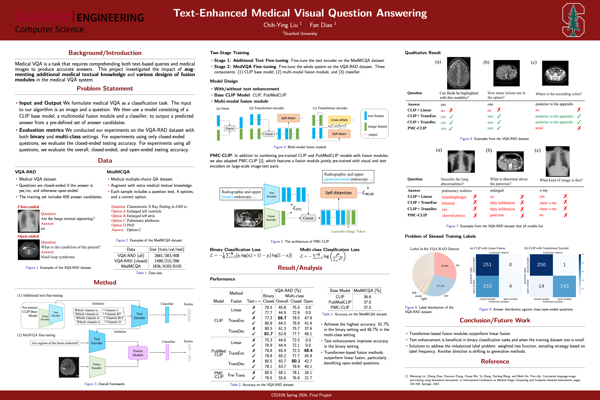

# Text-Enhanced Medical Visual Question Answering
This is the final project for the Stanford CS 231N class. Medical VQA is a task that requires comprehending both text-based queries and medical images to produce accurate answers. This project investigated the impact of aug- menting additional medical textual knowledge and various designs of fusion modules in the medical VQA system. 

Please refer to the [report](CS_231N_Final_Report.pdf) for further details.

## Usage
- Set up
    1. Install pytorch (>2.0.0), torchvision, torchaudio, pytorch-cuda. Refer to [pytorch official website](https://pytorch.org/get-started/previous-versions/) to find versions compatible with cuda.
    2. Install packages by ```pip install -r requirements.txt```
    3. (Optional) ```wandb login```
- Fine-tune on VQA-RAD dataset
    - CLIP + linear fusion
        ```
        python train_vqa.py \
        --dataset cs231n-Medco/vqa-rad \
        --task ["yesno" or "all"] \
        --base_model clip \
        --text_model_path [(optional) path_to_text_model_checkpoint] \
        --clip_model_name flaviagiammarino/pubmed-clip-vit-base-patch32 \
        --output_dir path_to_output_directory \
        --learning_rate 2e-6 \
        --num_train_epochs 20 \
        --logging_steps 50 \
        --save_steps 50 \
        --load_best_model_at_end
        ```
        - clip
          - ```--clip_model_name```: openai/clip-vit-base-patch32
          - ```--text_model_path```: new_clip_MedMCQA_lr-5e-06-wd-0.1-epoch-2-shuffled.pth

        - pubmedclip
          - ```clip_model_name```: flaviagiammarino/pubmed-clip-vit-base-patch32
          - ```text_model_path```: pub_med_clip_MedMCQA_lr-5e-06-wd-0.1-epoch-3-shuffled.pth
    - CLIP + transformer fusion
        ```
        python train_vqa.py \
        --dataset cs231n-Medco/vqa-rad \
        --task ["yesno" or "all"] \
        --base_model [clip or pubmedclip] \
        --text_model_path [(optional) path_to_text_model_checkpoint] \
        --clip_model_name flaviagiammarino/pubmed-clip-vit-base-patch32 \
        --transformer_fusion [decoder or encoder]
        --transformer_num_layers [(optional) 2]
        --output_dir path_to_output_directory \
        --learning_rate 2e-6 \
        --num_train_epochs 20 \
        --logging_steps 50 \
        --save_steps 50 \
        --load_best_model_at_end
        ```
    - PMC-CLIP (pre-trained self-attention fusion)
        - Download checkpoint from [pmc_oa_beta](https://huggingface.co/datasets/axiong/pmc_oa_beta/blob/main/checkpoint.pt)
        ```
        python train_vqa.py \
        --dataset cs231n-Medco/vqa-rad \
        --task ["yesno" or "all"] \
        --base_model pmc-clip \
        --text_model_path [(optional) path_to_text_model_checkpoint] \
        --checkpoint path_to_pmc-clip_checkpoint \
        --config ./modeling/pmc_clip/model_configs/RN50_fusion4.json \
        --pool_type average \
        --output_dir path_to_output_directory \
        --learning_rate 2e-6 \
        --num_train_epochs 20 \
        --logging_steps 50 \
        --save_steps 50 \
        --load_best_model_at_end
        ```
  - Inference
    - Run inference on test dataset.
    - Output a .csv file containing qid, ground truth label, predicted label, and predicted answer of each test example.
    - Calculate accuracy on closed/open/yesno/non-yesno subsets if specified.
    ```
    python inference_vqa.py \
    --dataset "cs231n-Medco/vqa-rad" \
    --task "binary" or "all" \
    --base_model “clip” or “pmc-clip” \
    --checkpoint  path_to_checkpoint \
    --output path_to_output_csv_file \
    --splits (optional) ["test-yesno", "test-nonyesno", "test-closed", "test-open"] \
    -- other model related arguments same as training
    ```
- Fine-tune on MedMCQA dataset
    - CLIP or PubMedCLIP
        ```
        python train_clip_medmcqa.py \
        --dataset openlifescienceai/medmcqa \
        --base_model clip \
        --clip_model_name ["openai/clip-vit-base-patch32" or "flaviagiammarino/pubmed-clip-vit-base-patch32"] \
        --output_dir path_to_output_directory \
        --batch_size 16 \
        --num_train_epochs 3
        ```
    - PMC-CLIP
        ```
        python train_clip_medmcqa.py \
        --dataset openlifescienceai/medmcqa \
        --base_model pmc-clip \
        --checkpoint path_to_checkpoint \
        --config ./modeling/pmc_clip/model_configs/RN50_fusion4.json \
        --output_dir path_to_output_directory \
        --batch_size 16 \
        --num_train_epochs 3
        ```
## Poster


### Acknowledgement

The PMC-CLIP implementation part of the project was adapted from the [the offical report of PMC-CLIP](https://github.com/WeixiongLin/PMC-CLIP), we thanks to the authors for sharing their code.
